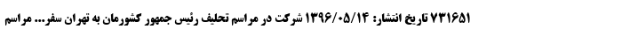
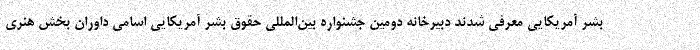
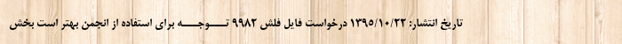
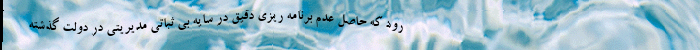
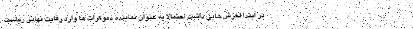
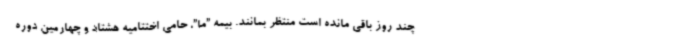

# *IDPL-PrFOD: An Image Dataset of Printed Farsi Text for OCR Research.*
This repository contains IDPL-PrFOD that is Printed Farsi OCR Dataset for Farsi optical character recognition researches.

The full dataset is uploaded in IDPL website and Google Drive you can download it in one of the following two ways:

 + [Google Drive](https://drive.google.com/drive/folders/1Nhvs5WFQH-EAVK0zk8YyyJnSMdvYJJhw?usp=sharing)
 + [IDPL website]
 
**Notes:**
 + *IDPL is abbreviation of “Intelligent Data Processing Laboratory”.*

 + *PrFOD is abbreviation of “ Printed Farsi OCR Dataset”.*

## IDPL-PrFOD Description
IDPL-PrFOD:
+ Is an artificial image dataset of printed Farsi text.

+ Has 30,138 images in **tif** format, each image containing a line of real Farsi text.

+ The dimensions of the images are 700 x 50 pixels.

+ 50% of the images are generated with a Plain white background, 40% with a noisy background and 10% with a texture background.
 
+ To increase the similarity of images with real images, we have added distortion and blur to 10% of the total images.
  + 4% sloping distortion.
  
  + 1% sinewave distortion.
 
  + 3% blur.
  
  + 2% both blur and one type of distortion.
  
+ To generate images, 11 common Farsi fonts with 2 font styles and 7 font sizes have been used.

+ To record image information, we have created a CSV file that has 30,138 rows, each row corresponding to an image.
 
**Notes:**

 + *We used [MirasText](https://github.com/miras-tech/MirasText/tree/master/MirasText) Dataset to generate text of each image.*

 + *We generated IDPL-PrFOD's images by using the Python programming language.*

 + *We used part of the code published [here](https://github.com/Belval/TextRecognitionDataGenerator) to add SineWave distortion to our images.*

## In which fields Farsi can be used?
 + Train phase of Farsi OCR engine.
 + Some branch of OCR research.

## Summery of IDPL-PrFOD
| | **Plain white** | **Noisy** | **Texture** | **Total image**| **Total Lines** | **Total Words** |
:-:|:-:|:-:|:-:|:-:|:-:|:-:
| **Each font** | 1,370 | 1,096 | 273/274 | 2,739/2,740 | 2,739/2,740 | 41,085/41,100 |
| **Total fonts** | 15,070 | 12,056 | 3,012 | 30,138 | 30,138 | 452,070 |

## Some of generated images in png format
#### *Plain white background:*

#### *Noisy background:*

#### *Texture background:*

#### *Texture background, Sinwave distortion:*

#### *Noisy background, Sloping(-1 degree) distortion:*

#### *Plain white background, Sinwave distortion, Gaussian blur:*

