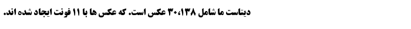
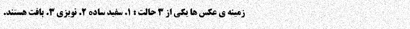
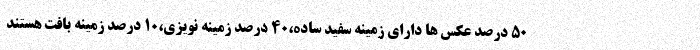
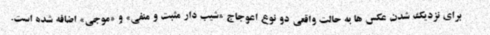
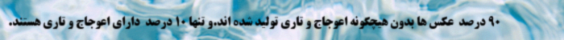
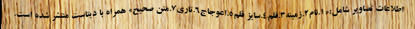

# *IDPL-PFOD: An Image Dataset of Printed Farsi Text for OCR Research*
This repository contains IDPL-PFOD that is an image dataset of printed Farsi text for Farsi optical character recognition researches.

Please refer to the following article(dataset's article), if you use dataset: 

F. s. Hosseini, S. Kashef, E. Shabaninia, and H. Nezamabadi-pour, "IDPL-PFOD: An Image Dataset of Printed Farsi Text for OCR Research," in *The Second International Workshop on NLP Solutions for Under Resourced Languages(NSURL 2021)*, Italy, 2021. (accepted)

The full dataset is uploaded in Google Drive which can be downloaded with the following link:

 + [Google Drive](https://drive.google.com/drive/folders/1TaQ5gZ4Q3ROw_X_HQi_U8lFenrwVlzlT?usp=sharing)
 
**Notes:**
 + *IDPL stands for “Intelligent Data Processing Laboratory”.*

 + *PFOD stands for “Printed Farsi OCR Dataset”.*
 
 + *The size of the dataset is 507 MB.*

## IDPL-PFOD Description
IDPL-PFOD:
+ Is an artificial image dataset of printed Farsi text.

+ Has 30,138 images in **tif** format, and each image contains a line of real Farsi text.

+ The dimensions of the images are 700 x 50 pixels.

+ 50% of the images are generated with a plain white background, 40% with a noisy background and 10% with a texture background.
 
+ To increase the similarity of images with real images,some distortion and blur is added to 10% of the total images. More precisely, we have:
  + 4% sloping distortion,
  
  + 1% sinewave distortion,
 
  + 3% blur,
  
  + 2% both blur and one type of distortion.
  
+ To generate images, 11 common Farsi fonts with 2 font styles and 7 font sizes have been used.

+ To record image information, we have created a CSV file that has 30,138 rows, each row corresponding to an image.
 
**Notes:**

 + *We used [MirasText](https://github.com/miras-tech/MirasText/tree/master/MirasText) Dataset to generate text of each image.*

 + *We generated IDPL-PFOD's images using Python programming language.*

 + *We used part of the code published [here](https://github.com/Belval/TextRecognitionDataGenerator) to add SineWave distortion to our images.*

## Summary of IDPL-PFOD
| | **Plain white** | **Noisy** | **Texture** | **Total images**| **Total Lines** | **Total Words** |
:-:|:-:|:-:|:-:|:-:|:-:|:-:
| **Each font** | 1,370 | 1,096 | 273 or 274 | 2,739 or 2,740 | 2,739 or 2,740 | 41,085 or 41,100 |
| **Total fonts** | 15,070 | 12,056 | 3,012 | 30,138 | 30,138 | 452,070 |

## Some of generated images in png format
#### *Plain white background:*

#### 

#### *Noisy background:*

#### 

#### 

#### *Texture background:*

#### 

#### 

